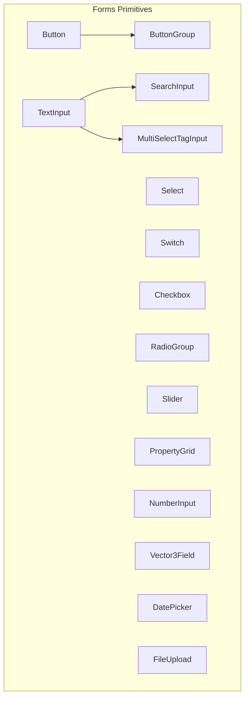
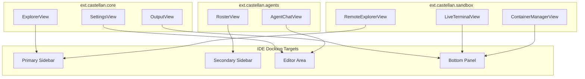

# Castellan UI Testing Plan & Parts Inventory

This testing plan serves as a blueprint for extending test coverage across all visual and client-side aspects of the **Castellan IDE**. 

Currently, only a small subset of reusable UI primitives have tests ([Button.test.ts](file:///c:/Users/price/code/Castellan/src/tests/client/ui-lib/Button.test.ts) and [Table.test.ts](file:///c:/Users/price/code/Castellan/src/tests/client/ui-lib/Table.test.ts)). To ensure type-safe and regression-proof frontend capabilities, we must systematically implement mock-DOM and integration-level tests for the remaining modules.

---

## 1. Core IDE Shell & Layout Management Services
These components control the top-level arrangement of views, docking, panels, resizing, theme styles, and overlays.

| UI Component/Service | Purpose | Key Behaviors to Test |
| :--- | :--- | :--- |
| **`LayoutManager`** | Top-level window dock grid (Sidebar, Editor Area, Bottom Panel, Secondary Sidebar). | • Initializing dimensions and split percentages. • Dynamic pane resizing and collapsing. • Correctly target-assigning view mounts. |
| **`DragDropManager`** | Handles panel and tab re-docking via drag-and-drop interactions. | • Tab drag-start and drag-end event handlers. • Drop validation targeting valid panels. • Dynamic dock repositioning upon successful drops. |
| **`ActivityBarService`** | Vertical activity bar containing view icons on the far left. | • Tab/View selection updating active sidebar state. • Icon badges showing numeric notifications. • Collapsing sidebar when clicking an already-active icon. |
| **`ThemeService`** | Style provider parsing color schemas and injecting CSS variables. | • Parsing theme properties into CSS custom properties (`--bg-primary`, etc.). • Theme switching (e.g. from `dark` to `light`). • Correct fallback defaults on invalid colors. |
| **`NotificationService`** & **`NotificationToast`** | System-wide floating alert toaster notifications. | • Spawning floating alerts on the correct corner target. • Dismissals (manual click-to-close & automatic timeouts). • Correct icons and style mappings for `success`, `info`, `warning`, `error`. |
| **`StatusBar`** & **`StatusBarItem`** | Footer indicator strip showing connection, sync, and branch details. | • Priority-based ordering of items (left/right alignment). • Dynamic value updating (e.g., branch change). • Click-to-action handlers bound to status items. |
| **`TitleBar`** & **`MenuBar`** | Header area containing application menus and quick controls. | • Dropdown overlay menu positioning. • Hotkey visual helpers inside menu entries. • Menu click handlers routing to target commands. |

---

## 2. Core Registries & Underlying Services
These underlying client services bridge the DOM with backend contracts, event streams, and workspace states.

| Client Service / Registry | Key Behaviors to Test |
| :--- | :--- |
| **`CommandRegistry`** | • Registering new commands with target callbacks. • Safe CLI-to-Client command invocation execution. • Handling duplicate command error boundaries. |
| **`ShortcutManager`** | • Capturing keydown actions and mapping to commands. • Multi-key chord processing (e.g. `Ctrl+K Ctrl+C`). • Input field isolation (no hotkeys triggered while typing). |
| **`EventBus`** | • Decoupled publisher-subscriber messaging. • Contextual event scoping (e.g., scoping to a specific active tab). • Unsubscribe cleanup to prevent memory leaks. |
| **`ViewRegistry`** | • View provider dynamic registration. • Querying registered views mapped to a designated `ViewLocation`. |
| **`ConfigurationService`** | • Loading user settings schema and updating active configurations. • Dispatching events upon settings changes (e.g., triggering font size update). |
| **`MonacoService`** | • Mounting a Monaco text editor instance into the DOM container. • Text sync mapping from Editor models to backend file systems. • LSP hover details and diagnostic underlines. |
| **`EditorManager`** & **`EditorTab`** | • Open, close, and rename file tab lifecycles. • Dirty state indicators (`●`) when changes are unsaved. • Prompting user confirmation on closing dirty tabs. |

---

## 3. UI Library Primitives (`ui-lib`)
These are isolated, reusable custom components extending `BaseComponent` that compose pages and extensions.

### A. Form Controls
All form elements must maintain type-safe validation, disabled states, and dynamic event dispatching.

* **`Button`** *(Already tested)*: Test label/icon render, disabled click protection, hover styling.
* **`TextInput`** & **`TextArea`**: Test text placeholder, change/input boundaries, multi-line auto-grow.
* **`Select`**: Test populating options list, selection rendering, programmatic value change.
* **`Switch`** & **`Checkbox`**: Test toggle toggle states, keyboard access (`Space`/`Enter`), unchecked/checked states.
* **`RadioGroup`**: Test single-selection constraints among options, custom layout rows/columns.
* **`Slider`**: Test step scaling bounds, value tooltip popups, keyboard slide controls.
* **`SearchInput`**: Test input debounce, clear button display, loading spinner states.
* **`PropertyGrid`**: Test editing fields, schema-defined value types (Boolean/String/Number) layout.
* **`Pagination`**: Test page calculation, button click triggers, first/last boundary lock.
* **`MultiSelectTagInput`**: Test adding chips/tags via input, clicking tag `x` to remove.
* **`DatePicker`**: Test opening select calendar popover, choosing dates, date constraints.
* **`FileUpload`**: Test drag-and-drop file target triggers, file select size limits, upload bars.
* **`Vector3Field`**: Test coordinate alignment inputs (X, Y, Z coordinates for telemetry fields).
* **`NumberInput`**: Test min/max range boundaries, increment/decrement button actions.

---

### B. Data Display & Feedback Components
These components organize text, structures, graphs, maps, and task states.

> [!NOTE]
> The **`Table`** primitive already has robust tests for sorting, custom rendering, and row selection in `Table.test.ts`.

* **`Tag`** & **`Badge`**: Test color variations, sizing variants, inline badges.
* **`Card`** & **`Avatar`**: Test card headers/footers, round avatar placeholder initials, source loading error fallbacks.
* **`JsonTree`**: Test tree collapsible nesting for nested object inspector, type-based color tags.
* **`GaugeCluster`**: Test scoring percentages, speedometer/radial bars, threshold color transitions.
* **`Timeline`**: Test sequential bubble items, time indicators, active item highlight.
* **`MiniMap`**: Test canvas map indicators, absolute coordinates relative scaling.
* **`FileTree`**: Test folder toggle expand, node selection, active path highlights.
* **`ProgressBar`** & **`Spinner`**: Test percentage transitions, size variations.
* **`StepProgress`**: Test visual checkpoint stages (Completed/Active/Pending).
* **`Alert`** & **`Skeleton`**: Test info/warning/error banners, animated loader skeletons.
* **`ForceColorBadge`**: Test strict color overrides for sandboxed processes.
* **`AgentToast`**: Test mini status toasts showing agent thinking/working steps.

---

### C. Layout & Overlay Components
These primitives govern component grouping, splitting, collapsing, and overlay positioning.

* **`Stack`**, **`Row`**, **`Column`**: Test flex layout parameters, spacing gap distributions.
* **`Divider`** & **`Spacer`**: Test horizontal/vertical line alignments and space filling.
* **`ScrollArea`**: Test overflow bars showing, custom scrollbar tracks.
* **`Collapsible`**: Test toggle arrows, opening/closing transitions.
* **`SplitView`**: Test multi-pane sizing grids, vertical/horizontal drag gutters.
* **`Accordion`**: Test singular pane expansion behavior (closing other panes on open).
* **`Carousel`**: Test sliding controls, indicators, touch-swipe event transitions.
* **`Modal`**: Test header-body-footer layout, backdrop clicks closing modals, trap-focus bounds.
* **`Popover`**: Test absolute anchor attachment calculations, auto-positioning on screen edge.
* **`ContextMenu`**: Test multi-level submenu flyouts, event position positioning.
* **`ConfirmDialog`**, **`PromptDialog`**, **`FormDialog`**: Test input text returns, submit/cancel triggers.
* **`QuickPickDialog`**: Test filtered lists searching, quick action navigation.
* **`Drawer`**: Test slide-in animations (Left/Right/Top/Bottom), overlay backdrops.

---

### D. Navigation, IDE Specific, & Typography
* **`Breadcrumb`** & **`BreadcrumbBar`**: Test path segments split, click segment navigation.
* **`Tab`** & **`Tabs`**: Test tab triggers, layout alignments.
* **`TreeItem`**: Test click selections, leaf indicators.
* **`VirtualList`**: Test render performance for high rows data list (only rendering visible rows).
* **`KeybindingLabel`**: Test parsing key arrays into shortcut badges (e.g., `Ctrl` `+` `Shift` `+` `P`).
* **`CodeBlock`**: Test syntax highlight rendering, copy code snippet to clipboard button.
* **`InlineEditWidget`**: Test double-click editable labels, escape/enter key validation.
* **`Heading`** & **`Text`**: Test font scale variables, paragraph line clamps.

---

## 4. IDE Built-in Extension Views (`src/client/extensions`)
These represent the integrated view implementations mapped to targeted layout zones.

### 4.1 Core & Workspace (`ext.castellan.core`)
* **`ExplorerView`**: Verify it populates files tree, registers double-clicks to open tabs.
* **`SettingsView`**: Verify search filters config settings, inputs update `ConfigurationService`.
* **`OutputView`**: Verify terminal-like text stream autoscrolls, clear button resets lines.

### 4.2 Agent Orchestration (`ext.castellan.agents`)
* **`AgentChatView`**: Test message stream render, LLM content markdown parse, scrolling inputs.
* **`RosterView`**: Test active agent cards, LLM profile info display, focus action toggle.

### 4.3 Execution & Infrastructure (`ext.castellan.sandbox`)
* **`LiveTerminalView`**: Test `xterm.js` rendering shell inputs and output streaming.
* **`ContainerManagerView`**: Test container table showing state (Running/Stopped), start/stop buttons.
* **`RemoteExplorerView`**: Test remote container file navigation tree.

### 4.4 Episodic Memory (`ext.castellan.journal`)
* **`LedgerView`**: Test memory events table, filter queries.
* **`DirectiveView`**: Test editing guidelines and active rules list inline.

### 4.5 Evaluation & Regression (`ext.castellan.audit`)
* **`TriageDeskView`**: Test multi-pane triage desk, diff compare inputs, grading scorecard triggers.
* **`RegressionArenaView`**: Test visual comparison test suite stats.
* **`ScorecardView`**: Test displaying judge scorecards, grade levels (A/B/C/F) gauges.

### 4.6 State & Task Management (`ext.castellan.kanban`)
* **`KanbanBoardView`**: Test drag-and-drop card columns, DAG node execution step highlights.
* **`TaskInspectorView`**: Test inspecting individual subtask schemas and agent parameters.

### 4.7 Version Control (`ext.castellan.github`)
* **`SourceControlView`**: Test lists modified files, unstaged/staged checkboxes, commit message box.
* **`DiffEditorView`**: Test line-by-line diff visualizer side-by-side or inline.

### 4.8 Web & Research (`ext.castellan.web`)
* **`BrowserPreviewView`**: Test iframe preview reload, URL bar navigation, back/forward buttons.
* **`SearchConsoleView`**: Test query inputs, search results listing.

### 4.9 Automation & Operations (`ext.castellan.cron`)
* **`JobSchedulerView`**: Test background tasks cron grid, switch sliders toggle schedules active/inactive.

### 4.10 System Telemetry (`ext.castellan.telemetry`)
* **`MapHUDView`**: Test canvas 3D workspace hub map telemetry coordinates.

### 4.11 The Editor Surface (`ext.castellan.editor`)
* **`CodeEditorView`**: Test opening Monaco editor models, tracking edits, focus triggers.

### 4.12 Live Debugger (`ext.castellan.debugger`)
* **`DebugControlView`**: Test step-over, step-in, pause, resume button states.
* **`VariableWatchView`**: Test JSON variables watch expanders.
* **`CallStackView`**: Test clicking frames highlights target files.

### 4.13 LLM Observability & Tracing (`ext.castellan.tracing`)
* **`TraceTreeView`**: Test tree graph tracing token usages, cost estimates dashboard metrics.

### 4.14 Database Explorer (`ext.castellan.db`)
* **`CollectionBrowserView`**: Test querying collections, paging through records grid.

### 4.15 Marketplace (`ext.castellan.registry`)
* **`ExtensionMarketplaceView`**: Test extensions searching card layout, install toggle.

### 4.16 Genesis (`ext.castellan.genesis`)
* **`GenesisView`**: Test onboarding setup configuration steps.

---

## 5. Remote API Separation & UI Verification Checklist
This checklist tracks the implementation, serving, and network isolation verification of the Castellan frontend running independently from the backend at `192.168.1.21`.

### A. Infrastructure & Network Configuration
- [x] **Vite Dev Server Proxy Routing**: Update `vite.config.ts` to default to the remote API host `http://192.168.1.21:3000` (and WebSocket events to `ws://192.168.1.21:3000`).
- [x] **Vite FS Allow List Expansion**: Configure `server.fs.allow` to allow the full workspace root `__dirname` to solve 403 Forbidden asset blocks for Monaco editor's CSS.
- [x] **Fastify Server CORS Enabled**: Implement custom `onRequest` Fastify hooks in `CastellanDaemon.ts` to enable `Access-Control-Allow-Origin: *` and intercept `OPTIONS` preflight requests.
- [x] **Dynamic LSP WebSocket URLs**: Refactor `LspBridge.ts` to parse and build correct WebSocket endpoints when `core.apiBase` is an absolute remote URL.
- [x] **Dynamic Extension Loading Root**: Refactor `ExtensionManager.ts` to resolve relative dynamic extension URLs relative to the API server's origin.

### B. UI-Only Runtime Verification
- [x] **UI-Only Server Booting**: Execute the standalone command `npm run cli -- start --ui-only` to launch Vite on `http://localhost:5173`.
- [x] **Monaco Asset Serving (No 403 blocks)**: Verify in browser console that all Monaco Editor stylesheets (e.g. `accessibleDiffViewer.css`, `colorPicker.css`, `style.css`) load successfully.
- [x] **ActivityBar Navigation**: Verify that the top-level shell icons open and render their respective panes.
- [x] **Preferences & Settings Panel**: Open `Preferences > Settings` to check configuration variables.
- [x] **Custom Sandbox Creation Modal**: Upgraded the standard browser-native `window.prompt` to the custom, beautiful HTML modal `PromptDialog` overlay to resolve browser dialog blocking and elevate aesthetics.
- [x] **Remote Server Integration (Direct Call)**: Verify that settings text input allows setting `core.apiBase` directly to `http://192.168.1.21:3000/api/v2`.
- [x] **Full-Suite Build Verification**: Ensure all modified files compile under strict TypeScript requirements (`npm run build`).

